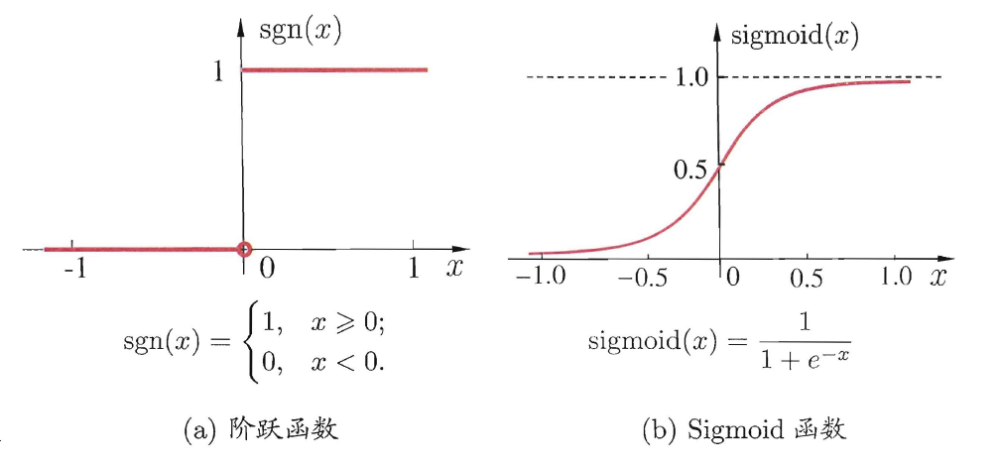

一、神经元模型：

1、M-P神经元模型：

神经元接收到来自n个其他神经元传递过来的**输入信号**，这些输入信号通过**带权重的连接进行传递**，神经元接收到的**总输入值将与神经元的阀值**进行比较，然后通过"激活函数" (activation function) 处理以产生神经元的输出.。

2、常见激活函数：

 3、**多层前馈神经网络**：神经元之间不存在同层连接， 也不存在跨层连接。

注：输入层神经元仅是接受输入 ，隐含层和输出层神经元都是拥有激活函数的功能神经元.

二、误差逆传播（BackPropagation BP）

$$w_i \leftarrow w_i+\Delta w_i$$   $$\Delta w_i = \eta (y-\widehat{y})x_i$$    

$$\eta \in (0,1)$$称为学习率，控制着算法每一轮迭代中的更新步长，若太大则容易震荡，太小则收敛速度会过慢。

，感知机的输出为$$\widehat{y}$$

