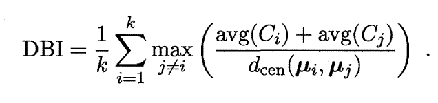
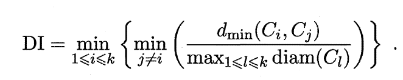

#### 一、聚类任务

1、无监督学习 ：目标是通过对**无标记训练样本**的学习来揭示数据的内在性质及规律。

2、聚类试图将数据集中的样本划分为若干个通常是**不相交的子集**，每个子集称为一个"**簇**" (cluster).

3、聚类既能作为一个**单独过程**，用于**找寻数据内在的分布结构**，也可作为**分类**等其他学习任务的**前驱过程**。

#### 二、性能度量

1、外部指标 (external index)：

将聚类结果与某个参考模型"(reference model)进行比较。

- Jaccard系数(Jaccard Coefficient):$$JC=\frac{a}{a+b+c}$$
- FMI指数：$$FMI=\sqrt{\frac{a}{a+b} \cdot \frac{a}{a+c}}$$
- Rand 指数：$$RI=\frac{2(a+d)}{m(m-1)}$$

性能度量的结果值均在[0,1] 区间，值越大越好。

2、内部指标(internal index)：

**直接考察聚类结果**而不利用任何参考模型。

$$avg(C)$$：簇C内样本间的平均距离。      $$diam(C)$$ ：簇C内样本间的最远距离

$$dim(C_i,C_j)$$：簇$$C_i$$与簇$$C_j$$最近样本间距离。     $$d_{cen}(C_i,C_j)$$ ：簇$$C_i$$与簇$$C_j$$中心点间的距离

- DB 指数：

- Dunn指数：

#### 三、距离计算

1、距离度量基本性质

非负性：$$dist(x_i,x_j) \geq 0$$

同一性：$$dist(x_i,x_j) = 0$$当且仅当$$x_i=x_j$$

对称性：$$dist(x_i,x_j) = dist(x_j,x_i) $$

直递性：$$dist(x_i,x_j) \leq dist(x_i,x_k) + dist(x_k,x_j)$$

2、距离计算公式

- 闵可夫斯基距离(Minkowski）：$$dist(x_i,x_j) =(\sum\limits_{i=1}^{N}|x_{iu}-x_{ju}|^p )^{\frac{1}{p}}$$    **用于有序属性**

p=1闵可夫斯基距离即**曼哈顿距离**(Manhattan distance）

p=2闵可夫斯基距离即**欧式距离**(Euclidean distance) 

- VDM(Value Difference Metric):

$$m_{u,a}$$表示在属性$$u$$上**取值为α 的样本数**，$$m_{u,a,i}$$表示**在第$$i$$个样本簇**中在属性$$u$$上取值为α 的样本数， k 为样本簇数

属性u上两个离散值α 与b之间的VDM距离：$$VDM_p(a,b)=\sum\limits_{i=1}^{k}|\frac{m_{u,a,i}}{m_{u,a}}-\frac{m_{u,b,i}}{m_{u,b}}|^p$$     **用于离散属性**

- 闵可夫斯基距离和VDM 结合(处理混合属性)

假定有$$n_c$$个有序属性，$$n-n_c$$个无序属性

$$MinkovDM_p (x_i,x_j) =(\sum\limits_{u=1}^{n_c}|x_{iu}-x_{ju}|^p+\sum\limits_{u=n_c+1}^{n}VDM(x_{iu},x_{ju})  )^{\frac{1}{p}}$$

#### 四、原型聚类

1、k均值算法

2、学习向量量化

3、高斯混合聚类：采用概率模型来表达聚类原型。

五、密度聚类：

聚类结构能通过样本分布的紧密程度确定 

DBSCAN：

六、层次聚类