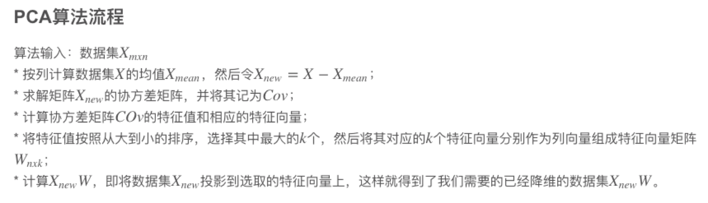
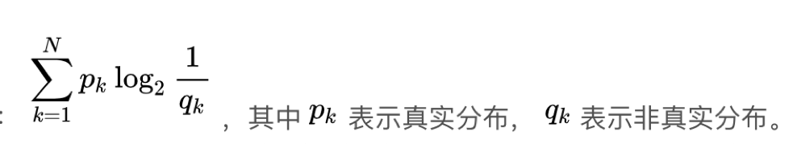

## 一、矩阵概念

##### 1、张量

​     代表坐标变换中不随坐标变换的量

##### 2、空间和张量 

​     仿射变换（图像旋转，平移，拉伸） 

##### 3、特征向量

​       $$A v = \lambda v$$ 【$$v$$是特征向量反映了矩阵A本身的固有特征， $$\lambda$$是特征值】

​      $$Av$$：向量的线性变换

​      $$\lambda v$$：该张量使得哪些向量只发生了拉伸变换

​      特征值： 衡量相应的拉伸系数

## 二、矩阵分解整理

##### 1、[LU分解](https://blog.csdn.net/u010945683/article/details/45803141)：**用于求解线性方程组以及求解矩阵的特征值**

​      将一个矩阵分解为一个单位下三角矩阵和一个上三角矩阵的乘积

​     $$E_{23}(1/5)E_{13}(1)E_{12}(-3)A=U \longrightarrow U=E_{12}(3)E_{13}(-1)E_{23}(-1/5)A=U $$

​	U：高斯消元法

##### 2、[QR分解](https://blog.csdn.net/ziyue246/article/details/88967324)：**用于求解线性方程组以及求解矩阵的特征值**

​	Q:Schmidt正交、标准化后得到

​	R：对角标准化*计算参数

##### 3、特征值分解

​        $$A=W\sum W^T$$  矩阵A必须为方阵

​	W是这n个特征向量所张成的n×n维矩阵

​        Σ为这n个特征值为主对角线的n×n维矩阵

##### 4、[SVD奇异值分解](https://zhuanlan.zhihu.com/p/29846048)

​      $$A_{m \times n} =U_{m \times m} \sum_{m \times n}  V^T_{n \times n} $$  不要求分解的矩阵为方阵

​      奇异值选择：选择占总奇异值总值90%的那些奇异值

​       U、V都是酉矩阵，**酉矩阵**： $$U^TU=I$$即$$V^T=V^{-1}$$

​      应用：信息压缩，特征提取

​      机器学习实现：[SVD分解](https://blog.csdn.net/qq_36523839/article/details/82347332)

##### 5、PCA主成分分析【降维】；

 	是**无监督学习**，完全无参数限制

##### 6、项目实战： 隐语义分析 LSA（Latent semantic analysis）

## 三、概率论

##### 1、正态分布：3sigma法则

##### 2、贝叶斯公式 ->朴素贝叶斯公式

​    多维高斯分布下的贝叶斯分类器等同于线性分类器 

##### 3、信息熵 ---> 决策树

##### 4、交叉熵 ---> 神经网络损失函数

## 四、最优化问题

1、最小二乘法

2、凸函数

3、最速下降法

