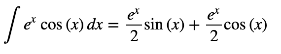

1、PCA降维度，计算协方差

2、泰勒展开式（多元）：<https://zhuanlan.zhihu.com/p/33316479>

3、对特征向量的理解

4、卡方检验：<https://segmentfault.com/a/1190000003719712>

5、混淆矩阵：<https://baike.baidu.com/item/%E6%B7%B7%E6%B7%86%E7%9F%A9%E9%98%B5>

6、参数搜索 RandomizedSearchCV、GridSearchCV问题

7、线性回归算法评价指标：<https://zhuanlan.zhihu.com/p/76469895>

- 均方差**MSE**（**mean-squared-error**）
- 均方根误差**RMSE**(Root Mean Square Error)【消除量纲的影响】
- 平均绝对误差 **MAE**（**Mean Absolute Error**）【当量纲不同时，难以衡量模型效果好坏】
- **R**方值（**R2_score**）【比较不同量纲下模型的好坏】

8、sklearn.metrics中的评估方：<https://blog.csdn.net/tsyccnh/article/details/79163834>法介绍：<https://blog.csdn.net/cherdw/article/details/55813071>

9、交叉熵在loss函数中的理解：<https://blog.csdn.net/tsyccnh/article/details/79163834>

10、矩阵求导公式：

11、深度学习最全优化方法总结比较：<https://zhuanlan.zhihu.com/p/22252270>

12、隐因子分解机（Factorization Machines）：<https://www.cnblogs.com/AndyJee/p/7879765.html>

